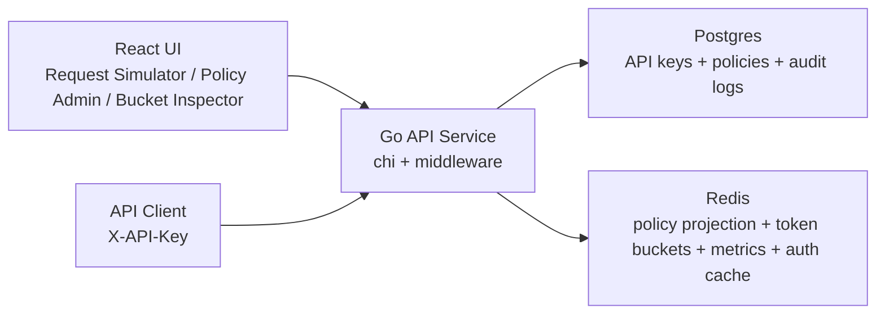

# Distributed Rate Limiting Service

Go backend + Redis token buckets + Postgres policy storage + a thin React UI for traffic simulation and inspection.

This project is intentionally backend-heavy. The UI exists to demonstrate the system, not to carry the system.

## What It Demonstrates

- Distributed rate limiting with Redis as shared hot-path state
- Deterministic policy resolution across multiple scope types
- Clean separation between durable config in Postgres and mutable runtime state in Redis
- Concurrency-aware Redis mutation without Lua, using optimistic locking
- Production-style Go service structure with clear boundaries between auth, policy resolution, bucket math, persistence, middleware, and handlers

## System Overview



### Data Ownership

- Postgres is the source of truth for:
  - `users`
  - `api_keys`
  - `rate_limit_policies`
  - `request_audit_logs`
- Redis stores fast shared state for:
  - API key auth cache
  - active policy projection
  - token bucket state
  - allowed vs blocked summary counters

## Architecture

### Repository Structure

```text
cmd/
  api/
  demo-bootstrap/
internal/
  audit/
  auth/
  config/
  db/
  handlers/
  middleware/
  policies/
  ratelimit/
  redisstate/
  routes/
migrations/
web/
```

### Protected Routes

| Route ID | Method | Path | Request Cost |
| --- | --- | --- | ---: |
| `ping` | `GET` | `/api/protected/ping` | 1 |
| `orders` | `POST` | `/api/protected/orders` | 2 |
| `report` | `GET` | `/api/protected/report` | 5 |

### Policy Scopes And Precedence

Supported scopes:

1. `global`
2. `api_key`
3. `route`
4. `api_key_route`

Resolution precedence:

1. `api_key_route`
2. `api_key`
3. `route`
4. `global`

Only one active policy can exist for a given scope tuple. That constraint is enforced in Postgres with partial unique indexes and shape checks, so policy resolution stays deterministic.

## Request Flow

For a protected request such as `GET /api/protected/report`:

1. The caller sends `X-API-Key`.
2. The Go service hashes that raw key and resolves the active API key, reading Redis first and Postgres on cache miss.
3. The route registry provides the route ID and request cost.
4. The policy resolver reads the Redis policy projection in precedence order.
5. The bucket store loads the matching bucket from Redis.
6. Token bucket refill and allow/block math runs in Go.
7. Redis `WATCH/MULTI/EXEC` persists the updated bucket with retry-on-conflict semantics.
8. The service returns either:
   - `200` plus `X-RateLimit-*` headers, or
   - `429` plus `Retry-After`

## Token Bucket Behavior

Each policy defines:

- `capacity`
- `refill_tokens`
- `refill_interval_seconds`

On each request:

1. Resolve the effective policy.
2. Calculate elapsed time since the last refill.
3. Add refilled tokens lazily.
4. Clamp to `capacity`.
5. Compare `tokens_remaining` against the route cost.
6. If enough tokens exist, decrement and allow.
7. Otherwise, block with `429`.

Buckets are stored in Redis under keys shaped like:

```text
ratelimit:bucket:{scope_type}:{scope_identifier}:{route_key}
```

Examples:

```text
ratelimit:bucket:global:default:ALL
ratelimit:bucket:route:default:report
ratelimit:bucket:api_key_route:<api_key_id>:orders
```

Idle buckets receive a TTL based on time-to-full so they naturally expire once no traffic is hitting them.

## Why Redis And Why Postgres

### Why Redis

Redis is used because rate limit state is:

- hot
- small
- shared across instances
- updated per request

That makes it a good fit for token bucket state and fast policy lookups.

### Why Postgres

Postgres stores durable configuration and history:

- API keys must survive restarts
- policies are admin-managed configuration
- audit logs are durable observability data

This split keeps the hot path fast while preserving a clean source of truth.

## Why Use Policy Projection

The `rate_limit_policies` table in Postgres is authoritative, but the request path should not query Postgres on every call. The service projects active policies into Redis in a lookup-friendly shape.

That projection is a read model, not a source of truth.

It exists to make protected request resolution fast and predictable:

- check `api_key_route`
- then `api_key`
- then `route`
- then `global`

## Why No Lua In V1

This version deliberately avoids Lua to make the concurrency story explicit in Go.

The bucket store uses Redis optimistic locking:

- `WATCH` the bucket and summary keys
- load the current state
- compute refill and decrement in Go
- write with `MULTI/EXEC`
- retry on conflict a bounded number of times

### Tradeoffs

Pros:

- easier to explain in interviews
- bucket math lives in typed Go code
- avoids embedding more logic in Redis scripts early

Cons:

- more round trips than server-side scripting
- under heavy contention, conflicts cause retries
- eventual scaling pressure may justify moving to Lua or another atomic server-side primitive

## Local Development

### Prerequisites

- Docker
- Docker Compose

### Quick Start

Start everything and apply migrations:

```bash
make up-detached
```

Create a demo API key and demo policies:

```bash
make demo-bootstrap
```

Stop everything:

```bash
make down
```

### Useful Commands

```bash
make test
make sqlc
make migrate-up
make migrate-down
```

## Demo Bootstrap

`make demo-bootstrap` creates:

- one fresh demo API key and prints the raw key once
- one global policy if none exists
- one route-scoped `report` policy if none exists
- one `api_key_route` policy for the newly created demo key on `orders`

Existing conflicting policies are left in place rather than overwritten.

If `PUBLIC_DEMO_MODE=true` and `PUBLIC_DEMO_RAW_API_KEY` is set, bootstrap becomes deterministic:

- it ensures that exact raw key exists in Postgres
- it keeps the key stable across restarts and redeploys
- it keeps the demo-mode public config endpoint aligned with a real API key in the database

## How To Use The App

After `make up-detached`:

- Backend: `http://localhost:8080`
- Frontend: `http://localhost:5173`
- Admin token: `dev-admin-token`

### UI Walkthrough

#### 1. Request Simulator

- Open `http://localhost:5173`
- Keep the default API base URL and admin token
- Click `Refresh API keys` if needed
- Either:
  - create a fresh session key from the simulator, or
  - select the bootstrapped demo key from the dropdown and paste the raw key returned by `make demo-bootstrap` into the `Paste raw key` field
- Choose `ping`, `orders`, or `report`
- Set request count and requests-per-second
- Start the run

What to watch:

- `ping` usually resolves to the global policy
- `report` should resolve to the route policy if one exists
- `orders` with the freshly bootstrapped demo key should resolve to `api_key_route`

#### 2. Policy Admin

- Open the `Policy Admin` tab
- Create, edit, or deactivate policies
- Use this page to demonstrate precedence changes live

Suggested demo:

1. create a strict `global` policy
2. create a more generous `route` policy for `report`
3. create an even more specific `api_key_route` policy for one key on `orders`

#### 3. Bucket Inspector

- Open the `Bucket Inspector` tab
- Choose a route and optional API key
- Inspect:
  - effective policy
  - matched scope
  - Redis bucket key
  - current tokens remaining
  - last refill timestamp
  - summary metrics

This is the best page for explaining the backend story during an interview.

## Deployment: Render

This repo now includes a [render.yaml](/Users/joe/Desktop/sand/rate_limiter/render.yaml) Blueprint for a public demo deployment:

- `distributed-rate-limiter-api` as a Docker web service
- `distributed-rate-limiter-web` as a static site
- `distributed-rate-limiter-db` as Postgres
- `distributed-rate-limiter-redis` as Render Key Value

The API service runs `demo-bootstrap && rate-limiter` on startup in the Render deployment, so the public demo key and seeded policies are recreated automatically if they are missing.

### Render Steps

1. Push this repo to GitHub.
2. In Render, create a new Blueprint from the repo.
3. When Render prompts for `PUBLIC_DEMO_RAW_API_KEY`, provide a long random key that starts with `rls_live_`.
4. Let Render provision the API, static site, Postgres, and Key Value services.
5. Open the API service in Render and copy its public URL.
6. Set `VITE_API_BASE_URL` on the `distributed-rate-limiter-web` static site to that API URL, then redeploy the static site.

Example demo key generation:

```bash
printf 'rls_live_%s\n' "$(openssl rand -hex 24)"
```

Recommended Render values:

- `PUBLIC_DEMO_MODE=true`
- `CORS_ALLOWED_ORIGIN=*`
- `REDIS_URL` from the Key Value internal connection string
- `POSTGRES_DSN` from the Postgres connection string

Why this setup works:

- the API honors Render's `PORT` environment variable automatically
- Redis connections now accept `redis://` / `rediss://` URLs
- public demo mode disables admin mutations but keeps read-only policy and bucket inspection visible
- the static site can stay thin while the Go service remains the main artifact

### Render Caveats

- The static site still needs the API URL wired into `VITE_API_BASE_URL`, because Blueprint files cannot automatically interpolate another service's public URL into a static-site build.
- Free Render services are fine for a portfolio demo, but they are not production-grade and may sleep, restart, or lose free Key Value data.

## Manual API Examples

Health:

```bash
curl http://localhost:8080/healthz
```

Admin ping:

```bash
curl -H 'Authorization: Bearer dev-admin-token' \
  http://localhost:8080/api/admin/ping
```

Create an API key:

```bash
curl -X POST \
  -H 'Authorization: Bearer dev-admin-token' \
  -H 'Content-Type: application/json' \
  -d '{"name":"primary"}' \
  http://localhost:8080/api/admin/api-keys
```

Create a global policy:

```bash
curl -X POST \
  -H 'Authorization: Bearer dev-admin-token' \
  -H 'Content-Type: application/json' \
  -d '{
    "scope_type":"global",
    "capacity":10,
    "refill_tokens":5,
    "refill_interval_seconds":60
  }' \
  http://localhost:8080/api/admin/policies
```

Call a protected route:

```bash
curl \
  -H "X-API-Key: <raw-key>" \
  http://localhost:8080/api/protected/ping
```

Inspect a bucket:

```bash
curl \
  -H 'Authorization: Bearer dev-admin-token' \
  'http://localhost:8080/api/admin/inspect/bucket?route_id=ping'
```

## Testing Strategy

- Unit tests cover:
  - API key generation and hashing
  - policy validation
  - precedence resolution
  - token bucket math
  - middleware behavior
- Integration-style tests cover:
  - Postgres-backed API key and policy flows
  - Redis projection
  - Redis bucket contention behavior

## Future Improvements

- Move bucket mutation to Lua or another server-side atomic primitive
- Add sliding-window or leaky-bucket variants
- Add IP-based and user-based scopes
- Add background projection reconciliation
- Add richer metrics export such as Prometheus
- Add configurable fail-open vs fail-closed behavior for Redis outages
- Add richer audit logging beyond blocked requests
- Add multi-instance local demos to show shared Redis behavior explicitly
